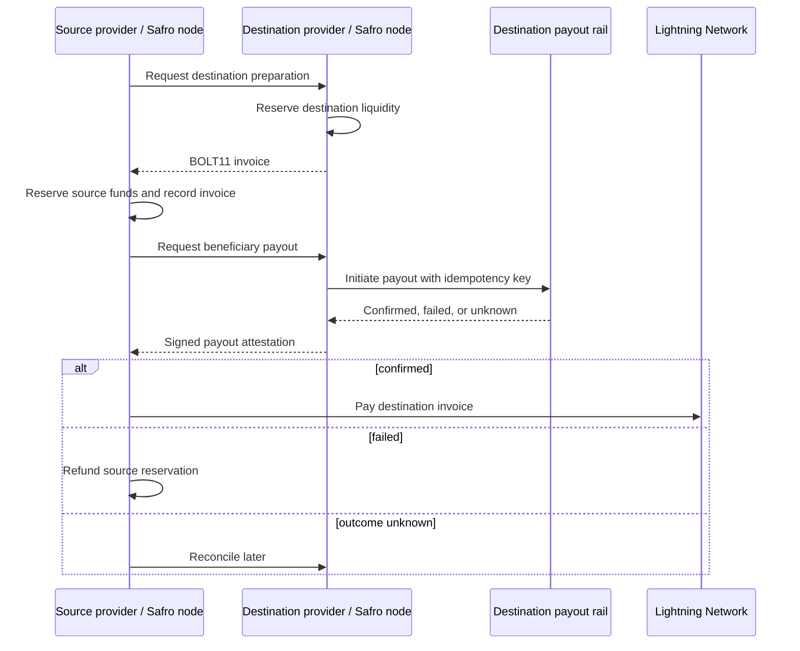

# Safro

Safro is a provider-to-provider protocol for cross-border settlement. A source
payment provider collects and reserves funds on its local rail; a destination
provider pays the beneficiary on its own local rail; the two providers settle
their resulting obligation over Bitcoin Lightning.

Safro is not a consumer wallet, a remittance app, or a replacement for local
payment providers. Each provider retains its customer relationship, KYC/AML
responsibilities, licensing, and local collection and payout rails.

## What this repository contains

`safrod` is the Rust reference daemon for the protocol. It currently includes:

- a typed settlement state machine with explicit release, refund, unknown, and
  dispute states;
- signed payout attestations, checked against a configured peer identity;
- signed executable quotes that bind provider identities, amounts, and expiry;
- an Axum JSON API for provider and peer actions;
- durable settlement records with restart recovery for accepted Lightning
  invoices;
- a Core Lightning JSON-RPC backend for real BOLT11 invoice creation and
  payment; and
- a deterministic fiat adapter for local development and automated tests.

The daemon does **not** currently include a production fiat-rail adapter,
provider onboarding, transport authentication, or a custody/compliance
programme. The configured adapter in `src/main.rs` is deliberately simulated,
so running this repository alone cannot send real NGN or KES payouts. A live
deployment needs a regulated provider on each corridor side and a real adapter
implemented against that provider's approved payout API.

## Settlement flow



Lightning is released only after a valid, authorized attestation confirms the
destination payout. A timeout becomes `PayoutUnknown`; it is never treated as
a failure automatically.

## Prerequisites

- Rust stable, including `rustfmt` and `clippy`
- Two reachable Core Lightning nodes with channel liquidity between them
- Access to each node's `lightning-rpc` Unix socket

The sample TOML files are local-development examples. They contain fixed demo
identity keys and machine-specific socket and store paths. Copy them outside
version control, replace every value, and protect production signing keys with
a proper secret-management system.

## Run locally

Build and verify the daemon:

```bash
cargo fmt --check
cargo clippy --all-targets --all-features -- -D warnings
cargo test --all
cargo run -- configs/ngn-node.toml
```

Start the destination node in a second terminal:

```bash
cargo run -- configs/kes-node.toml
```

Both configurations expect their configured Core Lightning RPC sockets to
exist. The NGN node listens on `127.0.0.1:8081`; the KES node listens on
`127.0.0.1:8082`.

To create a local settlement through the source node:

```bash
curl -X POST http://127.0.0.1:8081/settlements \
  -H 'content-type: application/json' \
  -d '{
    "fiat_amount": {"currency":"Ngn", "minor_units":500000},
    "destination_amount": {"currency":"Kes", "minor_units":30000},
    "btc_amount_msat": 100000,
    "counterparty": "kes-provider",
    "beneficiary": "local-development-beneficiary"
  }'
```

The response contains a `settlement_id`. Request destination payout and apply
the resulting attestation with:

```bash
curl -X POST http://127.0.0.1:8081/settlements/<settlement_id>/settle
```

Inspect progress with:

```bash
curl http://127.0.0.1:8081/settlements/<settlement_id>
```

## API surface

Provider-facing endpoints:

| Method | Path | Purpose |
| --- | --- | --- |
| `POST` | `/settlements` | Create a source-side settlement and obtain the destination invoice. |
| `GET` | `/settlements/:id` | Read the settlement state. |
| `POST` | `/settlements/:id/settle` | Ask the destination peer to pay out; release Lightning only after confirmation. |
| `POST` | `/settlements/:id/reconcile-peer` | Reconcile a destination payout that is still unknown. |
| `POST` | `/settlements/:id/release` | Release an already-confirmed source settlement. |
| `POST` | `/settlements/:id/refund` | Refund an already-failed source settlement. |

Peer-facing endpoints are under `/peer/`. They prepare a destination
settlement, issue invoices, accept payout requests, reconcile payout status,
and receive signed payout attestations. They are protocol endpoints and should
be exposed only through authenticated, mutually authorized provider transport.

## States and failure handling

The normal success path is:

`Created → Quoted → SourceReserved → DestinationReserved → SettlementConditionCreated → PayoutRequested → PayoutConfirmed → SettlementReleased`

A definite destination failure follows `PayoutFailed → Refunded`. An ambiguous
rail response follows `PayoutUnknown` until the destination provider
reconciles it. Conflicting signed evidence moves the settlement to `Disputed`
for human and contractual resolution.

## Production work still required

Before accepting real payments, the protocol needs the following operational
and engineering work:

- replace the development fiat adapter with adapters for onboarded, regulated
  providers and verify provider webhook signatures;
- add mutual TLS or equivalent authenticated transport, request signing,
  replay protection, authorization, and rate limits to peer endpoints;
- keep signing keys outside TOML files, add key rotation, audit logging, and
  monitored backups for settlement records;
- complete quote exchange and destination-side quote verification on the peer
  API, then version the wire protocol; and
- establish corridor-specific legal agreements, safeguarding, sanctions/AML
  controls, reconciliation operations, incident response, and dispute rules.

## Development

The GitHub Actions workflow runs formatting, Clippy with warnings denied, and
the full test suite for pushes and pull requests to `main`.

The package declares `MIT OR Apache-2.0`; add the corresponding license texts
before distributing a release.
